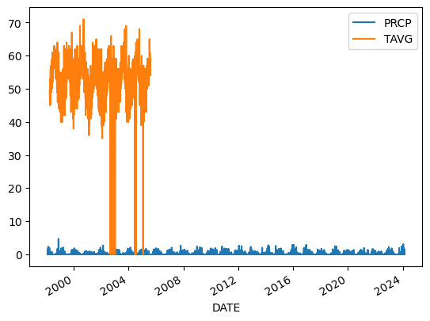
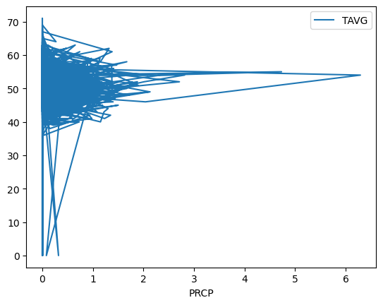
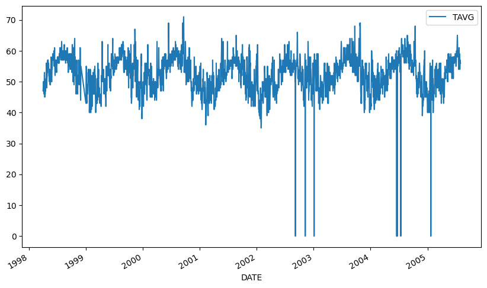
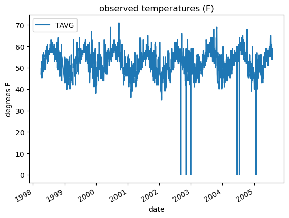
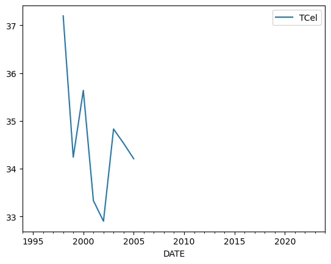
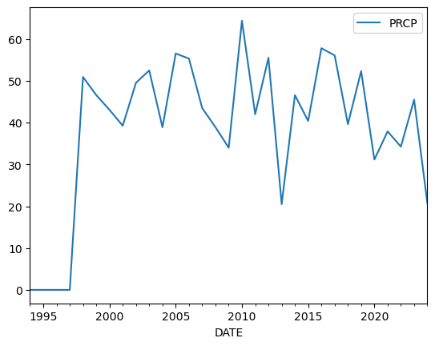
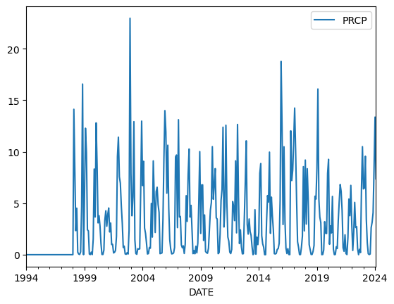
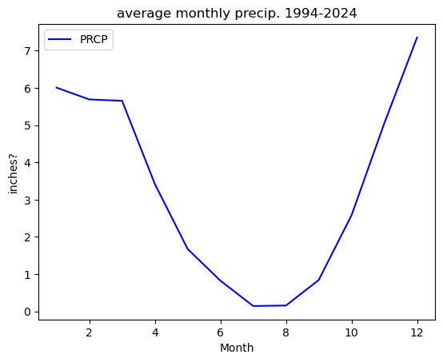
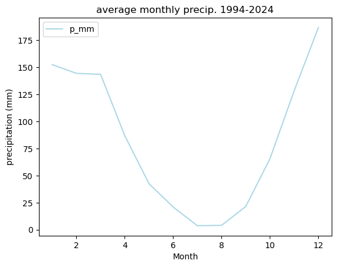
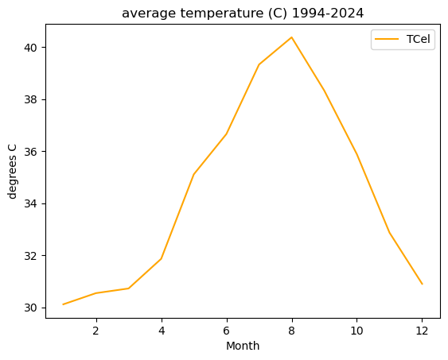

# Get started with open reproducible science! (API version)


## It’s another ESIIL Earth Data Science Workflow

This notebook contains your next environmental data science (EDS) coding
challenge! Before we get started, make sure to read or review the
guidelines below. These will help make sure that your code is *readable*
and *reproducible*.

------------------------------------------------------------------------

# **Get started with open reproducible science!**

[Open reproducible
science](https://www.earthdatascience.org/courses/intro-to-earth-data-science/open-reproducible-science/get-started-open-reproducible-science/)
makes scientific methods, data and outcomes available to everyone. That
means that *everyone* who wants should be able to **find**, **read**,
**understand**, and **run** your workflows for themselves.


Few if any science projects are 100% open and reproducible (yet!).
However, members of the open science community have developed open
source tools and practices that can help you move toward that goal. You
will learn about many of those tools in [the Intro to Earth Data Science
textbook](https://www.earthdatascience.org/courses/intro-to-earth-data-science/).
Don’t worry about learning all the tools at once – we’ve picked a few
for you to get started with.

------------------------------------------------------------------------

> **<i class="fa fa-solid fa-glasses fa-large" aria-label="glasses"></i>
> Further reading**
>
> Read [our textbook chapter about open reproducible
> science](https://www.earthdatascience.org/courses/intro-to-earth-data-science/open-reproducible-science/get-started-open-reproducible-science/).

> **<i class="fa fa-solid fa-pencil fa-large" aria-label="pencil"></i>
> What does open reproducible science mean to you?**
>
> <i class="far fa-regular fa-square" aria-label="square"></i> Create a
> new Markdown cell below this one using the `+ Markdown` button in the
> upper left.
>
> <i class="far fa-regular fa-square" aria-label="square"></i> In the
> new cell, answer the following questions using a **numbered list** in
> Markdown:
>
> 1.  In 1-2 sentences, define open reproducible science.
      given a data set with the same variables, you can re-do an analysis 
> 2.  In 1-2 sentences, choose one of the open source tools that you
>     have learned about (i.e. Shell, Git/GitHub, Jupyter Notebook,
>     Python) and explain how it supports open reproducible science.
      Github allows you to share data and code and collaborate together. 


1.  In 1-2 sentences, does this Jupyter Notebook file have a
    machine-readable name? Explain your answer.
    I think so because there are not spaces. 

------------------------------------------------------------------------

## **Readable, well-documented scientific workflows are easier to reproduce**

> In the prompt below, list 3 things you can do to write clean code, and
> then list 3 more advantages of doing so.**
>
> -   Edit the text below. You may have to double click.
> -   You can use examples from the textbook, or come up with your own.
> -   Use [**Markdown**](https://www.markdownguide.org/) to format your
>     list.

I can write clean code by: 

- including comments 
- loading all the packages at the top 
- descriptive variable names 

Advantages of clean code include: 

- when you take a break and come back to your code after a while, you won't be as confused 
- easier to share with others 

------------------------------------------------------------------------                                                                                                                                                                                            |

## **There are more Earth Observation data online than any one person could ever look at**

[NASA’s Earth Observing System Data and Information System (EOSDIS)
alone manages over 9PB of
data](https://www.earthdata.nasa.gov/learn/articles/getting-petabytes-people-how-eosdis-facilitates-earth-observing-data-discovery-and-use).
1 PB is roughly 100 times the entire Library of Congress (a good
approximation of all the books available in the US). It’s all available
to **you** once you learn how to download what you want.

Here we’re using the NOAA National Centers for Environmental Information
(NCEI) [Access Data
Service](https://www.ncei.noaa.gov/support/access-data-service-api-user-documentation)
application progamming interface (API) to request data from their web
servers. We will be using data collected as part of the Global
Historical Climatology Network daily (GHCNd) from their [Climate Data
Online library](https://www.ncdc.noaa.gov/cdo-web/datasets) program at
NOAA.

For this example we’re requesting [daily summary data in Arcata, CA
(station ID
USW00024283)](https://www.ncdc.noaa.gov/cdo-web/datasets/GHCND/stations/GHCND:USW00024283/detail)
located on the Arcata Eureka Airport 

> **<i class="fa fa-solid fa-pencil fa-large" aria-label="pencil"></i>
> Your task:**
>
> 1.  Research the [**Global Historical Climatology Network -
>     Daily**](https://www.ncei.noaa.gov/metadata/geoportal/rest/metadata/item/gov.noaa.ncdc:C00861/html)
>     data source.
> 2.  In the cell below, write a 2-3 sentence description of the data
>     source. You should describe:
>     -   who takes the data
>     -   where the data were taken
>     -   what the maximum temperature units are
>     -   how the data are collected
> 3.  Include a citation of the data (**HINT:** See the ‘Data Citation’
>     tab on the GHCNd overview page).

**YOUR DATA DESCRIPTION AND CITATION HERE** 🛎️

## **You can access NCEI GHCNd Data from the internet using its API** 🖥️ 📡 🖥️

The cell below contains the URL for the data you will use in this part
of the notebook. We created this URL by generating what is called an
**API endpoint** using the NCEI [API
documentation](https://www.ncei.noaa.gov/support/access-data-service-api-user-documentation).

> **Note**
>
> An **application programming interface** (API) is a way for two or
> more computer programs or components to communicate with each other.
> It is a type of software interface, offering a service to other pieces
> of software ([Wikipedia](https://en.wikipedia.org/wiki/API)).

However, we still have a problem - we can’t get the URL back later on
because it isn’t saved in a **variable**. In other words, we need to
give the url a name so that we can request in from Python later (sadly,
Python has no ‘hey what was that thingy I typed yesterday?’ function).

> **<i class="fa fa-solid fa-glasses fa-large" aria-label="glasses"></i>
> Read more**
>
> Check out the [textbook section on
> variables](https://www.earthdatascience.org/courses/intro-to-earth-data-science/python-code-fundamentals/get-started-using-python/variables/)

> **<i class="fa fa-solid fa-keyboard fa-large" aria-label="keyboard"></i>
> Your task**
>
> 1.  Pick an expressive variable name for the URL
>
>     > HINT: click on the `Variables` button up top to see all your
>     > variables. Your new url variable will not be there until you
>     > define it and run the code
>
> 2.  Reformat the URL so that it adheres to the [79-character PEP-8
>     line limit](https://peps.python.org/pep-0008/#maximum-line-length)
>
>     > HINT: You should see two vertical lines in each cell - don’t let
>     > your code go past the second line
>
> 3.  At the end of the cell where you define your url variable, **call
>     your variable (type out its name)** so it can be tested.


```python
import pandas as pd

stuff23 = ('https://www.ncei.noaa.gov/access/services/da'
'ta/v1?dataset=daily-summaries&dataTypes=TAVG,PRCP&stations=USW00024283&startDate=1941-12-01&endDate=2024-02-18&includeStationName=true&includeStation'
'Location=1&units=standard')
stuff23


```


    'https://www.ncei.noaa.gov/access/services/data/v1?dataset=daily-summaries&dataTypes=TAVG,PRCP&stations=USW00024283&startDate=1941-12-01&endDate=2024-02-18&includeStationName=true&includeStationLocation=1&units=standard'


```python
# DO NOT MODIFY THIS TEST CELL
resp_url = _
points = 0

if type(resp_url)==str:
    points += 3
    print('\u2705 Great work! You correctly called your url variable.')
else:
    print('\u274C Oops - your url variable was not called correctly.')

if len(resp_url)==218:
    points += 3
    print('\u2705 Great work! Your url is the correct length.')
else:
    print('\u274C Oops - your url variable is not the correct length.')

print('You earned {} of 6 points for defining a url variable'.format(points))
```

    ✅ Great work! You correctly called your url variable.
    ✅ Great work! Your url is the correct length.
    You earned 6 of 6 points for defining a url variable


------------------------------------------------------------------------

## **Download and get started working with NCEI data**

The `pandas` library you imported can download data from the internet
directly into a type of Python **object** called a `DataFrame`. In the
code cell below, you can see an attempt to do just this. But there are
some problems…

> **<i class="fa fa-solid fa-keyboard fa-large" aria-label="keyboard"></i>
> You’re ready to fix some code!**
>
> Your task is to:
>
> 1.  Leave a space between the `#` and text in the comment and try
>     making the comment more informative
>
> 2.  Make any changes needed to get this code to run. HINT: The
>     `my_url` variable doesn’t exist - you need to replace it with the
>     variable name **you** chose.
>
> 3.  Modify the `.read_csv()` statement to include the following
>     parameters:
>
>     -   `index_col='DATE'` – this sets the `DATE` column as the index.
>         Needed for subsetting and resampling later on
>     -   `parse_dates=True` – this lets `python` know that you are
>         working with time-series data, and values in the indexed
>         column are **date time objects**
>     -   `na_values=['NaN']` – this lets `python` know how to handle
>         missing values
>
> 4.  Clean up the code by using **expressive variable names**,
>     **expressive column names**, **PEP-8 compliant code**, and
>     **descriptive comments**

**Make sure to call your `DataFrame` by typing it’s name as the last
line of your code cell** Then, you will be able to run the test cell
below and find out if your answer is correct.


```python
eureka_url = stuff23

# loading in the data from the stuff23 website URL 
eureka_df = pd.read_csv(
  eureka_url, 
  index_col= 'DATE',
  parse_dates=True,
  na_values=['NaN'])
eureka_df
```


<div>
<style scoped>
    .dataframe tbody tr th:only-of-type {
        vertical-align: middle;
    }

    .dataframe tbody tr th {
        vertical-align: top;
    }

    .dataframe thead th {
        text-align: right;
    }
</style>
<table border="1" class="dataframe">
  <thead>
    <tr style="text-align: right;">
      <th></th>
      <th>STATION</th>
      <th>NAME</th>
      <th>LATITUDE</th>
      <th>LONGITUDE</th>
      <th>ELEVATION</th>
      <th>PRCP</th>
      <th>TAVG</th>
    </tr>
    <tr>
      <th>DATE</th>
      <th></th>
      <th></th>
      <th></th>
      <th></th>
      <th></th>
      <th></th>
      <th></th>
    </tr>
  </thead>
  <tbody>
    <tr>
      <th>1992-04-01</th>
      <td>USW00024283</td>
      <td>ARCATA EUREKA AIRPORT, CA US</td>
      <td>40.97844</td>
      <td>-124.10479</td>
      <td>64.5</td>
      <td>NaN</td>
      <td>NaN</td>
    </tr>
    <tr>
      <th>1992-04-02</th>
      <td>USW00024283</td>
      <td>ARCATA EUREKA AIRPORT, CA US</td>
      <td>40.97844</td>
      <td>-124.10479</td>
      <td>64.5</td>
      <td>NaN</td>
      <td>NaN</td>
    </tr>
    <tr>
      <th>1992-04-03</th>
      <td>USW00024283</td>
      <td>ARCATA EUREKA AIRPORT, CA US</td>
      <td>40.97844</td>
      <td>-124.10479</td>
      <td>64.5</td>
      <td>NaN</td>
      <td>NaN</td>
    </tr>
    <tr>
      <th>1992-04-04</th>
      <td>USW00024283</td>
      <td>ARCATA EUREKA AIRPORT, CA US</td>
      <td>40.97844</td>
      <td>-124.10479</td>
      <td>64.5</td>
      <td>NaN</td>
      <td>NaN</td>
    </tr>
    <tr>
      <th>1992-04-05</th>
      <td>USW00024283</td>
      <td>ARCATA EUREKA AIRPORT, CA US</td>
      <td>40.97844</td>
      <td>-124.10479</td>
      <td>64.5</td>
      <td>NaN</td>
      <td>NaN</td>
    </tr>
    <tr>
      <th>...</th>
      <td>...</td>
      <td>...</td>
      <td>...</td>
      <td>...</td>
      <td>...</td>
      <td>...</td>
      <td>...</td>
    </tr>
    <tr>
      <th>2024-02-14</th>
      <td>USW00024283</td>
      <td>ARCATA EUREKA AIRPORT, CA US</td>
      <td>40.97844</td>
      <td>-124.10479</td>
      <td>64.5</td>
      <td>1.45</td>
      <td>NaN</td>
    </tr>
    <tr>
      <th>2024-02-15</th>
      <td>USW00024283</td>
      <td>ARCATA EUREKA AIRPORT, CA US</td>
      <td>40.97844</td>
      <td>-124.10479</td>
      <td>64.5</td>
      <td>0.39</td>
      <td>NaN</td>
    </tr>
    <tr>
      <th>2024-02-16</th>
      <td>USW00024283</td>
      <td>ARCATA EUREKA AIRPORT, CA US</td>
      <td>40.97844</td>
      <td>-124.10479</td>
      <td>64.5</td>
      <td>0.01</td>
      <td>NaN</td>
    </tr>
    <tr>
      <th>2024-02-17</th>
      <td>USW00024283</td>
      <td>ARCATA EUREKA AIRPORT, CA US</td>
      <td>40.97844</td>
      <td>-124.10479</td>
      <td>64.5</td>
      <td>1.14</td>
      <td>NaN</td>
    </tr>
    <tr>
      <th>2024-02-18</th>
      <td>USW00024283</td>
      <td>ARCATA EUREKA AIRPORT, CA US</td>
      <td>40.97844</td>
      <td>-124.10479</td>
      <td>64.5</td>
      <td>0.46</td>
      <td>NaN</td>
    </tr>
  </tbody>
</table>
<p>11611 rows × 7 columns</p>
</div>


```python
# DO NOT MODIFY THIS TEST CELL
tmax_df_resp = _
points = 0

if isinstance(tmax_df_resp, pd.DataFrame):
    points += 1
    print('\u2705 Great work! You called a DataFrame.')
else:
    print('\u274C Oops - make sure to call your DataFrame for testing.')

print('You earned {} of 2 points for downloading data'.format(points))
```

    ✅ Great work! You called a DataFrame.
    You earned 1 of 2 points for downloading data


> HINT: Check out the `type()` function below - you can use it to check
> that your data is now in `DataFrame` type object


```python
# Check that the data was imported into a pandas DataFrame
type(eureka_df)
```


    pandas.core.frame.DataFrame


> **<i class="fa fa-solid fa-keyboard fa-large" aria-label="keyboard"></i>
> Clean up your DataFrame**
>
> Use double brackets to only select the columns you want in your
> DataFrame

**Make sure to call your `DataFrame` by typing it’s name as the last
line of your code cell** Then, you will be able to run the test cell
below and find out if your answer is correct.


```python
eureka_df = eureka_df[['PRCP', 'TAVG']]
eureka_df
eureka_df.mean().values
```


    array([ 0.12590128, 52.2934947 ])


```python
# DO NOT MODIFY THIS TEST CELL
tmax_df_resp = _
points = 0

summary = [round(val, 2) for val in tmax_df_resp.mean().values]
if summary == [0.05, 54.53]:
    points += 4
    print('\u2705 Great work! You correctly downloaded data.')
else:
    print('\u274C Oops - your data are not correct.')
print('You earned {} of 5 points for downloading data'.format(points))
```

    ❌ Oops - your data are not correct.
    You earned 0 of 5 points for downloading data


------------------------------------------------------------------------

## Plot the precpitation column (PRCP) vs time to explore the data

Plotting in Python is easy, but not quite this easy:


```python
eureka_df.plot()

eureka_df.plot('PRCP')
```


    <Axes: xlabel='PRCP'>


    

    


    

    


You’ll always need to add some instructions on labels and how you want
your plot to look.

> **Important**
>
> 1.  Change `dataframe` to **your** `DataFrame` name.
> 2.  Change `y=` to the name of your **observed temperature** column
>     name.
> 3.  Use the `title`, `ylabel`, and `xlabel` parameters to add key text
>     to your plot.
> 4.  Adjust the size of your figure using `figsize=(x,y)` where `x` is
>     figure width and `y` is figure height
>
> > **HINT:** labels have to be a *type* in Python called a **string**.
> > You can make a string by putting quotes around your label, just like
> > the column names in the sample code (eg `y='TOBS'`).


```python
# Plot the temperature vs time
eureka_df.plot(y='TAVG', figsize=(10,6))
```


    <Axes: xlabel='DATE'>


    

    


> **<i class="fa fa-solid fa-keyboard fa-large" aria-label="keyboard"></i>
> Your task: Playing with code**
>
> 1.  Replace `dataframe` with the name of **your** dataframe whenever
>     it appears.
> 2.  Replace the **title** and **axis labels** with something more
>     appropriate for this data.
> 3.  Run the code below.


```python
# Plot the data using .plot
eureka_df.plot(
    y='TAVG',
    title='observed temperatures (F)',
    xlabel='date',
    ylabel='degrees F')
```


    <Axes: title={'center': 'observed temperatures (F)'}, xlabel='date', ylabel='degrees F'>


    

    


> **<i class="fa fa-solid fa-pepper-hot fa-large" aria-label="pepper-hot"></i>
> Want an EXTRA CHALLENGE?**
>
> There are many other things you can do to customize your plot. Take a
> look at the [pandas plotting
> galleries](https://pandas.pydata.org/docs/user_guide/visualization.html)
> and the [documentation of
> plot](https://pandas.pydata.org/docs/reference/api/pandas.DataFrame.plot.html)
> to see if there’s other changes you want to make to your plot. Some
> possibilities include:
>
> -   Remove the legend since there’s only one data series
> -   Increase the figure size
> -   Increase the font size
> -   Change the colors
> -   Use a bar graph instead (usually we use lines for time series, but
>     since this is annual it could go either way)
> -   Add a trend line
>
> Not sure how to do any of these? Try searching the internet, or asking
> an AI!

------------------------------------------------------------------------

> **<i class="fa fa-solid fa-pepper-hot fa-large" aria-label="pepper-hot"></i>
> Convert units**
>
> Modify the code below to **add a column that includes temperature in
> Celsius**. The code below was written by your colleague. Can you fix
> this so that it correctly calculates temperature in Celsius and adds a
> new column?


```python
# Convert to celcius
eureka_df['TCel'] = eureka_df['TAVG'] - 32 * 5 / 9
eureka_df

```

    /tmp/ipykernel_6191/1952523685.py:2: SettingWithCopyWarning: 
    A value is trying to be set on a copy of a slice from a DataFrame.
    Try using .loc[row_indexer,col_indexer] = value instead
    
    See the caveats in the documentation: https://pandas.pydata.org/pandas-docs/stable/user_guide/indexing.html#returning-a-view-versus-a-copy
      eureka_df['TCel'] = eureka_df['TAVG'] - 32 * 5 / 9


<div>
<style scoped>
    .dataframe tbody tr th:only-of-type {
        vertical-align: middle;
    }

    .dataframe tbody tr th {
        vertical-align: top;
    }

    .dataframe thead th {
        text-align: right;
    }
</style>
<table border="1" class="dataframe">
  <thead>
    <tr style="text-align: right;">
      <th></th>
      <th>PRCP</th>
      <th>TAVG</th>
      <th>TCel</th>
    </tr>
    <tr>
      <th>DATE</th>
      <th></th>
      <th></th>
      <th></th>
    </tr>
  </thead>
  <tbody>
    <tr>
      <th>1992-04-01</th>
      <td>NaN</td>
      <td>NaN</td>
      <td>NaN</td>
    </tr>
    <tr>
      <th>1992-04-02</th>
      <td>NaN</td>
      <td>NaN</td>
      <td>NaN</td>
    </tr>
    <tr>
      <th>1992-04-03</th>
      <td>NaN</td>
      <td>NaN</td>
      <td>NaN</td>
    </tr>
    <tr>
      <th>1992-04-04</th>
      <td>NaN</td>
      <td>NaN</td>
      <td>NaN</td>
    </tr>
    <tr>
      <th>1992-04-05</th>
      <td>NaN</td>
      <td>NaN</td>
      <td>NaN</td>
    </tr>
    <tr>
      <th>...</th>
      <td>...</td>
      <td>...</td>
      <td>...</td>
    </tr>
    <tr>
      <th>2024-02-14</th>
      <td>1.45</td>
      <td>NaN</td>
      <td>NaN</td>
    </tr>
    <tr>
      <th>2024-02-15</th>
      <td>0.39</td>
      <td>NaN</td>
      <td>NaN</td>
    </tr>
    <tr>
      <th>2024-02-16</th>
      <td>0.01</td>
      <td>NaN</td>
      <td>NaN</td>
    </tr>
    <tr>
      <th>2024-02-17</th>
      <td>1.14</td>
      <td>NaN</td>
      <td>NaN</td>
    </tr>
    <tr>
      <th>2024-02-18</th>
      <td>0.46</td>
      <td>NaN</td>
      <td>NaN</td>
    </tr>
  </tbody>
</table>
<p>11611 rows × 3 columns</p>
</div>


```python
# DO NOT MODIFY THIS TEST CELL
tmax_df_resp = _
points = 0

if isinstance(tmax_df_resp, pd.DataFrame):
    points += 1
    print('\u2705 Great work! You called a DataFrame.')
else:
    print('\u274C Oops - make sure to call your DataFrame for testing.')

summary = [round(val, 4) for val in tmax_df_resp.mean().values]
if summary == [0.0543, 54.5313, 12.5174]:
    points += 4
    print('\u2705 Great work! You correctly converted to Celcius.')
else:
    print('\u274C Oops - your data are not correct.')
print('You earned {} of 5 points for converting to Celcius'.format(points))
```

    ✅ Great work! You called a DataFrame.
    ❌ Oops - your data are not correct.
    You earned 1 of 5 points for converting to Celcius


> **<i class="fa fa-solid fa-pepper-hot fa-large" aria-label="pepper-hot"></i>
> Want an EXTRA CHALLENGE?**
>
> 1.  As you did above, rewrite the code to be more expressive
> 2.  Using the code below as a framework, write and apply a
>     **function** that converts to Celcius. \> **Functions** let you
>     reuse code you have already written
> 3.  You should also rewrite this function and parameter names to be
>     more expressive.


```python
def f_to_c(t_fahrenheit):
    """Convert temperature to Celcius"""
    t_celsius = t_fahrenheit - 32 * 5 / 9
    return t_celsius # Put your equation in here

eureka_df['t_cel'] = eureka_df['TAVG'].apply(f_to_c)
eureka_df
```

    /tmp/ipykernel_6191/4048438812.py:6: SettingWithCopyWarning: 
    A value is trying to be set on a copy of a slice from a DataFrame.
    Try using .loc[row_indexer,col_indexer] = value instead
    
    See the caveats in the documentation: https://pandas.pydata.org/pandas-docs/stable/user_guide/indexing.html#returning-a-view-versus-a-copy
      eureka_df['t_cel'] = eureka_df['TAVG'].apply(f_to_c)


<div>
<style scoped>
    .dataframe tbody tr th:only-of-type {
        vertical-align: middle;
    }

    .dataframe tbody tr th {
        vertical-align: top;
    }

    .dataframe thead th {
        text-align: right;
    }
</style>
<table border="1" class="dataframe">
  <thead>
    <tr style="text-align: right;">
      <th></th>
      <th>PRCP</th>
      <th>TAVG</th>
      <th>TCel</th>
      <th>t_cel</th>
    </tr>
    <tr>
      <th>DATE</th>
      <th></th>
      <th></th>
      <th></th>
      <th></th>
    </tr>
  </thead>
  <tbody>
    <tr>
      <th>1992-04-01</th>
      <td>NaN</td>
      <td>NaN</td>
      <td>NaN</td>
      <td>NaN</td>
    </tr>
    <tr>
      <th>1992-04-02</th>
      <td>NaN</td>
      <td>NaN</td>
      <td>NaN</td>
      <td>NaN</td>
    </tr>
    <tr>
      <th>1992-04-03</th>
      <td>NaN</td>
      <td>NaN</td>
      <td>NaN</td>
      <td>NaN</td>
    </tr>
    <tr>
      <th>1992-04-04</th>
      <td>NaN</td>
      <td>NaN</td>
      <td>NaN</td>
      <td>NaN</td>
    </tr>
    <tr>
      <th>1992-04-05</th>
      <td>NaN</td>
      <td>NaN</td>
      <td>NaN</td>
      <td>NaN</td>
    </tr>
    <tr>
      <th>...</th>
      <td>...</td>
      <td>...</td>
      <td>...</td>
      <td>...</td>
    </tr>
    <tr>
      <th>2024-02-14</th>
      <td>1.45</td>
      <td>NaN</td>
      <td>NaN</td>
      <td>NaN</td>
    </tr>
    <tr>
      <th>2024-02-15</th>
      <td>0.39</td>
      <td>NaN</td>
      <td>NaN</td>
      <td>NaN</td>
    </tr>
    <tr>
      <th>2024-02-16</th>
      <td>0.01</td>
      <td>NaN</td>
      <td>NaN</td>
      <td>NaN</td>
    </tr>
    <tr>
      <th>2024-02-17</th>
      <td>1.14</td>
      <td>NaN</td>
      <td>NaN</td>
      <td>NaN</td>
    </tr>
    <tr>
      <th>2024-02-18</th>
      <td>0.46</td>
      <td>NaN</td>
      <td>NaN</td>
      <td>NaN</td>
    </tr>
  </tbody>
</table>
<p>11611 rows × 4 columns</p>
</div>


## **Subsetting and Resampling**

Often when working with time-series data you may want to focus on a
shorter window of time, or look at weekly, monthly, or annual summaries
to help make the analysis more manageable.

> **<i class="fa fa-solid fa-glasses fa-large" aria-label="glasses"></i>
> Read more**
>
> Read more about
> [subsetting](https://www.earthdatascience.org/courses/use-data-open-source-python/use-time-series-data-in-python/date-time-types-in-pandas-python/subset-time-series-data-python/)
> and
> [resampling](https://www.earthdatascience.org/courses/use-data-open-source-python/use-time-series-data-in-python/date-time-types-in-pandas-python/resample-time-series-data-pandas-python/)
> time-series data in our Learning Portal.

For this demonstration, we will look at the last 30-40 years worth of
data and resample to explore a summary from each year that data were
recorded.

> **<i class="fa fa-solid fa-keyboard fa-large" aria-label="keyboard"></i>
> Your task**
>
> 1.  Replace `start-year` and `end-year` with the years that begin and
>     end the window of time that you would like to explore
> 2.  Replace `dataframe` with the name of **your** data
> 3.  Replace `new_variable_name` with something more expressive
> 4.  Call your new variable
> 5.  Run the cell


```python
# Subset the data to look at 1983-2023
eureka_1994_2024 = eureka_df['1994':'2024']
eureka_1994_2024
```


<div>
<style scoped>
    .dataframe tbody tr th:only-of-type {
        vertical-align: middle;
    }

    .dataframe tbody tr th {
        vertical-align: top;
    }

    .dataframe thead th {
        text-align: right;
    }
</style>
<table border="1" class="dataframe">
  <thead>
    <tr style="text-align: right;">
      <th></th>
      <th>PRCP</th>
      <th>TAVG</th>
      <th>TCel</th>
      <th>t_cel</th>
    </tr>
    <tr>
      <th>DATE</th>
      <th></th>
      <th></th>
      <th></th>
      <th></th>
    </tr>
  </thead>
  <tbody>
    <tr>
      <th>1994-01-01</th>
      <td>NaN</td>
      <td>NaN</td>
      <td>NaN</td>
      <td>NaN</td>
    </tr>
    <tr>
      <th>1994-01-02</th>
      <td>NaN</td>
      <td>NaN</td>
      <td>NaN</td>
      <td>NaN</td>
    </tr>
    <tr>
      <th>1994-01-03</th>
      <td>NaN</td>
      <td>NaN</td>
      <td>NaN</td>
      <td>NaN</td>
    </tr>
    <tr>
      <th>1994-01-04</th>
      <td>NaN</td>
      <td>NaN</td>
      <td>NaN</td>
      <td>NaN</td>
    </tr>
    <tr>
      <th>1994-01-05</th>
      <td>NaN</td>
      <td>NaN</td>
      <td>NaN</td>
      <td>NaN</td>
    </tr>
    <tr>
      <th>...</th>
      <td>...</td>
      <td>...</td>
      <td>...</td>
      <td>...</td>
    </tr>
    <tr>
      <th>2024-02-14</th>
      <td>1.45</td>
      <td>NaN</td>
      <td>NaN</td>
      <td>NaN</td>
    </tr>
    <tr>
      <th>2024-02-15</th>
      <td>0.39</td>
      <td>NaN</td>
      <td>NaN</td>
      <td>NaN</td>
    </tr>
    <tr>
      <th>2024-02-16</th>
      <td>0.01</td>
      <td>NaN</td>
      <td>NaN</td>
      <td>NaN</td>
    </tr>
    <tr>
      <th>2024-02-17</th>
      <td>1.14</td>
      <td>NaN</td>
      <td>NaN</td>
      <td>NaN</td>
    </tr>
    <tr>
      <th>2024-02-18</th>
      <td>0.46</td>
      <td>NaN</td>
      <td>NaN</td>
      <td>NaN</td>
    </tr>
  </tbody>
</table>
<p>10971 rows × 4 columns</p>
</div>


```python
# DO NOT MODIFY THIS TEST CELL
tmax_df_resp = _
points = 0

if isinstance(tmax_df_resp, pd.DataFrame):
    points += 1
    print('\u2705 Great work! You called a DataFrame.')
else:
    print('\u274C Oops - make sure to call your DataFrame for testing.')

summary = [round(val, 2) for val in tmax_df_resp.mean().values]
if summary == [0.06, 55.67, 13.15]:
    points += 4
    print('\u2705 Great work! You correctly converted to Celcius.')
else:
    print('\u274C Oops - your data are not correct.')
print('You earned {} of 5 points for converting to Celcius'.format(points))
```

    ✅ Great work! You called a DataFrame.
    ❌ Oops - your data are not correct.
    You earned 1 of 5 points for converting to Celcius


## Now we are ready to calculate annual statistics

Here you will **resample** the 2013-2023 data to look the annual mean
values.

> **<i class="fa fa-solid fa-keyboard fa-large" aria-label="keyboard"></i>
> Resample your data**
>
> 1.  Replace `new_variable_name` with the variable you created in the
>     cell above where you subset the data
> 2.  Replace `'TIME'` with a `'W'`, `'M'`, or `'Y'` depending on
>     whether you’re doing a weekly, monthly, or yearly summary
> 3.  Replace `STAT` with a `sum`, `min`, `max`, or `mean` depending on
>     what kind of statistic you’re interested in calculating.
> 4.  Replace `resampled_data` with a more expressive variable name
> 5.  Call your new variable
> 6.  Run the cell


```python
# Resample the data to look at yearly mean values
eureka_yearly_mean = eureka_1994_2024.resample('Y').mean()
eureka_yearly_mean
```

    /tmp/ipykernel_6191/3074794418.py:2: FutureWarning: 'Y' is deprecated and will be removed in a future version, please use 'YE' instead.
      eureka_yearly_mean = eureka_1994_2024.resample('Y').mean()


<div>
<style scoped>
    .dataframe tbody tr th:only-of-type {
        vertical-align: middle;
    }

    .dataframe tbody tr th {
        vertical-align: top;
    }

    .dataframe thead th {
        text-align: right;
    }
</style>
<table border="1" class="dataframe">
  <thead>
    <tr style="text-align: right;">
      <th></th>
      <th>PRCP</th>
      <th>TAVG</th>
      <th>TCel</th>
      <th>t_cel</th>
    </tr>
    <tr>
      <th>DATE</th>
      <th></th>
      <th></th>
      <th></th>
      <th></th>
    </tr>
  </thead>
  <tbody>
    <tr>
      <th>1994-12-31</th>
      <td>NaN</td>
      <td>NaN</td>
      <td>NaN</td>
      <td>NaN</td>
    </tr>
    <tr>
      <th>1995-12-31</th>
      <td>NaN</td>
      <td>NaN</td>
      <td>NaN</td>
      <td>NaN</td>
    </tr>
    <tr>
      <th>1996-12-31</th>
      <td>NaN</td>
      <td>NaN</td>
      <td>NaN</td>
      <td>NaN</td>
    </tr>
    <tr>
      <th>1997-12-31</th>
      <td>NaN</td>
      <td>NaN</td>
      <td>NaN</td>
      <td>NaN</td>
    </tr>
    <tr>
      <th>1998-12-31</th>
      <td>0.168020</td>
      <td>54.975410</td>
      <td>37.197632</td>
      <td>37.197632</td>
    </tr>
    <tr>
      <th>1999-12-31</th>
      <td>0.127644</td>
      <td>52.019178</td>
      <td>34.241400</td>
      <td>34.241400</td>
    </tr>
    <tr>
      <th>2000-12-31</th>
      <td>0.117650</td>
      <td>53.415301</td>
      <td>35.637523</td>
      <td>35.637523</td>
    </tr>
    <tr>
      <th>2001-12-31</th>
      <td>0.107562</td>
      <td>51.109890</td>
      <td>33.332112</td>
      <td>33.332112</td>
    </tr>
    <tr>
      <th>2002-12-31</th>
      <td>0.135699</td>
      <td>50.679452</td>
      <td>32.901674</td>
      <td>32.901674</td>
    </tr>
    <tr>
      <th>2003-12-31</th>
      <td>0.143781</td>
      <td>52.608219</td>
      <td>34.830441</td>
      <td>34.830441</td>
    </tr>
    <tr>
      <th>2004-12-31</th>
      <td>0.106257</td>
      <td>52.307692</td>
      <td>34.529915</td>
      <td>34.529915</td>
    </tr>
    <tr>
      <th>2005-12-31</th>
      <td>0.154904</td>
      <td>51.985782</td>
      <td>34.208004</td>
      <td>34.208004</td>
    </tr>
    <tr>
      <th>2006-12-31</th>
      <td>0.151534</td>
      <td>NaN</td>
      <td>NaN</td>
      <td>NaN</td>
    </tr>
    <tr>
      <th>2007-12-31</th>
      <td>0.119123</td>
      <td>NaN</td>
      <td>NaN</td>
      <td>NaN</td>
    </tr>
    <tr>
      <th>2008-12-31</th>
      <td>0.106311</td>
      <td>NaN</td>
      <td>NaN</td>
      <td>NaN</td>
    </tr>
    <tr>
      <th>2009-12-31</th>
      <td>0.093151</td>
      <td>NaN</td>
      <td>NaN</td>
      <td>NaN</td>
    </tr>
    <tr>
      <th>2010-12-31</th>
      <td>0.176329</td>
      <td>NaN</td>
      <td>NaN</td>
      <td>NaN</td>
    </tr>
    <tr>
      <th>2011-12-31</th>
      <td>0.115068</td>
      <td>NaN</td>
      <td>NaN</td>
      <td>NaN</td>
    </tr>
    <tr>
      <th>2012-12-31</th>
      <td>0.152082</td>
      <td>NaN</td>
      <td>NaN</td>
      <td>NaN</td>
    </tr>
    <tr>
      <th>2013-12-31</th>
      <td>0.056192</td>
      <td>NaN</td>
      <td>NaN</td>
      <td>NaN</td>
    </tr>
    <tr>
      <th>2014-12-31</th>
      <td>0.127589</td>
      <td>NaN</td>
      <td>NaN</td>
      <td>NaN</td>
    </tr>
    <tr>
      <th>2015-12-31</th>
      <td>0.110685</td>
      <td>NaN</td>
      <td>NaN</td>
      <td>NaN</td>
    </tr>
    <tr>
      <th>2016-12-31</th>
      <td>0.157896</td>
      <td>NaN</td>
      <td>NaN</td>
      <td>NaN</td>
    </tr>
    <tr>
      <th>2017-12-31</th>
      <td>0.153644</td>
      <td>NaN</td>
      <td>NaN</td>
      <td>NaN</td>
    </tr>
    <tr>
      <th>2018-12-31</th>
      <td>0.108575</td>
      <td>NaN</td>
      <td>NaN</td>
      <td>NaN</td>
    </tr>
    <tr>
      <th>2019-12-31</th>
      <td>0.143342</td>
      <td>NaN</td>
      <td>NaN</td>
      <td>NaN</td>
    </tr>
    <tr>
      <th>2020-12-31</th>
      <td>0.085397</td>
      <td>NaN</td>
      <td>NaN</td>
      <td>NaN</td>
    </tr>
    <tr>
      <th>2021-12-31</th>
      <td>0.103836</td>
      <td>NaN</td>
      <td>NaN</td>
      <td>NaN</td>
    </tr>
    <tr>
      <th>2022-12-31</th>
      <td>0.093836</td>
      <td>NaN</td>
      <td>NaN</td>
      <td>NaN</td>
    </tr>
    <tr>
      <th>2023-12-31</th>
      <td>0.124658</td>
      <td>NaN</td>
      <td>NaN</td>
      <td>NaN</td>
    </tr>
    <tr>
      <th>2024-12-31</th>
      <td>0.422857</td>
      <td>NaN</td>
      <td>NaN</td>
      <td>NaN</td>
    </tr>
  </tbody>
</table>
</div>


> **<i class="fa fa-solid fa-keyboard fa-large" aria-label="keyboard"></i>
> Plot your resampled data**


```python
# Plot mean annual temperature values

eureka_yearly_mean.plot(y="TCel")

eureka_ann_p = eureka_1994_2024.resample('YE').sum()
eureka_ann_p.plot(y="PRCP")

```


    <Axes: xlabel='DATE'>


    

    


    

    


```python
# get monthly sum 
eureka_month_p = eureka_1994_2024.resample('ME').sum()
eureka_month_p.plot(y="PRCP")

# reset index so date can be grouped by month 
eureka_month_ind = eureka_month_p

eureka_month_ind.reset_index(inplace=True)

# Rename the column to 'Date'
eureka_month_ind.rename(columns={'index': 'Date'}, inplace=True)

# plot monthly values 
eureka_monthly_p = eureka_month_ind.groupby(eureka_month_ind['DATE'].dt.month).mean()
eureka_monthly_p.plot(y="PRCP",
                    title='average monthly precip. 1994-2024',
    xlabel='Month',
    ylabel='inches?',
    color='blue')

eureka_monthly_p['p_mm'] = eureka_monthly_p['PRCP'] * 25.4
eureka_monthly_p.plot(y="p_mm",
                    title='average monthly precip. 1994-2024',
    xlabel='Month',
    ylabel='precipitation (mm)',
    color='lightblue')

```


    <Axes: title={'center': 'average monthly precip. 1994-2024'}, xlabel='Month', ylabel='precipitation (mm)'>


    

    


    

    


    

    


```python
# reset index so date can be grouped by month 
eureka_1994_2024_ind = eureka_1994_2024

eureka_1994_2024_ind.reset_index(inplace=True)

# Rename the column to 'Date'
eureka_1994_2024_ind.rename(columns={'index': 'Date'}, inplace=True)

# plot monthly values 
eureka_monthly_clim = eureka_1994_2024_ind.groupby(eureka_1994_2024_ind['DATE'].dt.month).mean()
#eureka_monthly_clim

eureka_monthly_clim.plot(y="TCel",
    title='average temperature (C) 1994-2024',
    xlabel='Month',
    ylabel='degrees C',
    color='orange')

```

    /tmp/ipykernel_6191/3224361432.py:5: SettingWithCopyWarning: 
    A value is trying to be set on a copy of a slice from a DataFrame
    
    See the caveats in the documentation: https://pandas.pydata.org/pandas-docs/stable/user_guide/indexing.html#returning-a-view-versus-a-copy
      eureka_1994_2024.rename(columns={'index': 'Date'}, inplace=True)


    <Axes: title={'center': 'average temperature (C) 1994-2024'}, xlabel='Month', ylabel='degrees C'>


    

    


------------------------------------------------------------------------

> **<i class="fa fa-solid fa-pencil fa-large" aria-label="pencil"></i>
> Describe your plot**
>
> We like to use an approach called “Assertion-Evidence” for presenting
> scientific results. There’s a lot of video tutorials and example talks
> available on [the Assertion-Evidence web
> page](https://www.assertion-evidence.com/). The main thing you need to
> do now is to practice writing a **message** or **headline** rather
> than descriptions or topic sentences for the plot you just made (what
> they refer to as “visual evidence”).
>
> For example, it would be tempting to write something like “A plot of
> maximum annual temperature in Boulder, Colorado over time
> (1983-2023)”. However, this doesn’t give the reader anything to look
> at, or explain why we made this particular plot (we know, you made
> **this** one because we told you to)
>
> Some alternatives that are more of a starting point for a presentation
> or conversation are: \* Boulder, CO experienced cooler than average
> temperatures in 1995 \* Temperatures in Bouler, CO appear to be on the
> rise over the past 40 years \* Maximum annual temperatures in Boulder,
> CO are becoming more variable over the previous 40 years
>
> We could back up some of these claims with further analysis included
> later on, but we want to make sure that our audience has some guidance
> on what to look for in the plot.

------------------------------------------------------------------------

## **YOUR BOULDER PLOT HEADLINE HERE** 📰 🗞️ 📻

*Describe your plot in this cell in 2-3 sentences*

<figure>

<figcaption aria-hidden="true">Writing bear</figcaption>
</figure>

> Image credit: https://www.craiyon.com/image/OAbZtyelSoS7FdGko6hvQg

------------------------------------------------------------------------

# **THIS ISN’T THE END!** 😄

**Don’t forget to *reproduce your analysis* in a new location or time!**


> Image source:
> https://www.independent.co.uk/climate-change/news/by-the-left-quick-march-the-emperor-penguins-migration-1212420.html

------------------------------------------------------------------------

## **Your turn: pick a new location and/or measurement to plot** 🌏 📈

Below (or in a new notebook!), recreate the workflow you just did in a
place that interests you OR with a different measurement. See the
instructions above to adapt the URL that we created for Boulder, CO
using the NCEI API. You will need to make your own new Markdown and Code
cells below this one, or create a new notebook.

------------------------------------------------------------------------

## **Congratulations, you’re almost done with this coding challenge** 🤩 – now make sure that your code is *reproducible*


> Image source:
> https://dfwurbanwildlife.com/2018/03/25/chris-jacksons-dfw-urban-wildlife/snow-geese-galore/

> **<i class="fa fa-solid fa-keyboard fa-large" aria-label="keyboard"></i>
> Your task**
>
> 1.  If you didn’t already, go back to the code you modified about and
>     write more descriptive **comments** so the next person to use this
>     code knows what it does.
>
> 2.  Make sure to `Restart` and `Run all` up at the top of your
>     notebook. This will clear all your variables and make sure that
>     your code runs in the correct order. It will also export your work
>     in Markdown format, which you can put on your website.

------------------------------------------------------------------------

## BONUS: Create a shareable Markdown of your work

Below is some code that you can run that will save a Markdown file of
your work that is easily shareable and can be uploaded to GitHub Pages.
You can use it as a starting point for writing your portfolio post!


```python
%%capture
%%bash
jupyter nbconvert RT_copy.ipynb --to markdown
```


    ---------------------------------------------------------------------------

    CalledProcessError                        Traceback (most recent call last)

    Cell In[1], line 1
    ----> 1 get_ipython().run_cell_magic('bash', '', 'jupyter nbconvert 01-dsc-open-science.ipynb --to markdown\n')


    File /opt/conda/lib/python3.11/site-packages/IPython/core/interactiveshell.py:2541, in InteractiveShell.run_cell_magic(self, magic_name, line, cell)
       2539 with self.builtin_trap:
       2540     args = (magic_arg_s, cell)
    -> 2541     result = fn(*args, **kwargs)
       2543 # The code below prevents the output from being displayed
       2544 # when using magics with decorator @output_can_be_silenced
       2545 # when the last Python token in the expression is a ';'.
       2546 if getattr(fn, magic.MAGIC_OUTPUT_CAN_BE_SILENCED, False):


    File /opt/conda/lib/python3.11/site-packages/IPython/core/magics/script.py:155, in ScriptMagics._make_script_magic.<locals>.named_script_magic(line, cell)
        153 else:
        154     line = script
    --> 155 return self.shebang(line, cell)


    File /opt/conda/lib/python3.11/site-packages/IPython/core/magics/script.py:315, in ScriptMagics.shebang(self, line, cell)
        310 if args.raise_error and p.returncode != 0:
        311     # If we get here and p.returncode is still None, we must have
        312     # killed it but not yet seen its return code. We don't wait for it,
        313     # in case it's stuck in uninterruptible sleep. -9 = SIGKILL
        314     rc = p.returncode or -9
    --> 315     raise CalledProcessError(rc, cell)


    CalledProcessError: Command 'b'jupyter nbconvert 01-dsc-open-science.ipynb --to markdown\n'' returned non-zero exit status 255.

