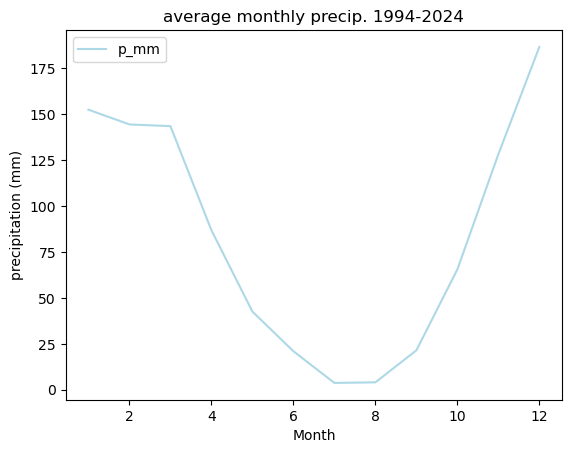

## Rachel Torres

Hi! I am Rachel, recently became Dr. Torres. I am currently a postdoctoral researcher with a mutli-institutional network working to develop earth and environmental data science curriculum with an Indigenous methods lens. I work in INRSEP+ at Cal-Poly Humboldt. My collaborators are part of the Ecological Forecasting Initiative and the Geoscience Alliance.

**Research**

Received PhD from UC Santa Barbara's Bren School of Environmental Science and Management. I worked in the Tague Lab and used the eco-hydrologic model RHESSys.

My dissertation research was in urban eco-hydrology; I am motivated to improve how we can efficiently use water resources and vegetation as green infrastructure to make cities more equitable and sustainable.

**Teaching Experience**
- Data visualization and Science Communication, NSF-AGEP Fellow (ESRM303) Environmental Science and Resource Management, CSU Channel Islands
- Earth Systems Science, TA (ESM203) Bren Master's of Environmental Science and Management, UC Santa Barbara)
- Environmental Modeling, TA (EDS230) Bren Master's of Environmental Data Science, UC Santa Barbara
- Introduction to Environmental Science, Lead TA (ENVS2) Environmental Studies, UC Santa Barbara
- Our Dynamic Earth, Instructor (INT 93LS) Summer Research Academies, UC Santa Barbara

To find out more, please see my CV. 

Contact Me
email: rdt47@humboldt.edu

here is the campus where I currently work:
<embed type="text/html" src="pics/cph.html" width="600" height="600">

arcata airport climatology: 

source: NOAA Global Historical Climatology Network daily, station USW00024283

see code for making the above plots [here](RT_copy.html)
